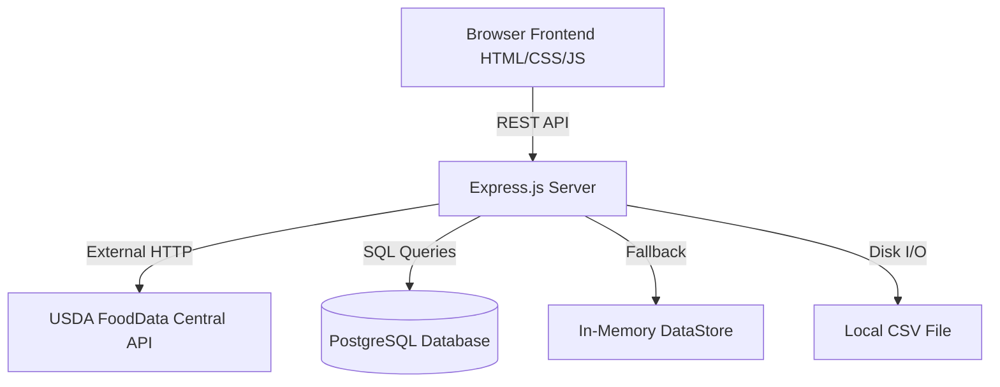

# CALTRC

## Project Definition (M0)

- **Project name:** CALTRC
- **Primary user:** People who want to track calories and improve their health.
- **Problem statement (1 sentence):** People struggle to track calories consistently because logging food is annoying and time-consuming.

### Primary Workflow (3–5 steps)
1. User signs up for the app.
2. User completes a short survey to establish a health goal.
3. The app creates a custom health plan based on the survey.
4. User scans barcodes of food they eat.
5. The app pulls food macros and updates the daily goal automatically.

### MVP Scope (max 3 features)
1. Introductory survey to obtain health goals of the user.
2. Food and meal macro inputting and storage.
3. Tailoring daily food goals based on survey results.

### Out of Scope
- Live food analysis from a picture.
- Social features or sharing.
- Medical advice or diagnosis.
- Payment or subscription features.

---

## Architecture Diagram


## Roadmap (Next 6 Months)
- **Q3 2026**: Wire up the completed Health Survey module into the user onboarding UI to provide personalized calorie goals dynamically.
- **Q4 2026**: Fully migrate all in-memory persistence to PostgreSQL for users, food logs, and surveys.
- **Q1 2027**: Multi-day reporting and user progression trends.

---

## Getting Started

### Prerequisites
- Node.js (v18 or higher recommended)
- npm or yarn

### Installation

1. Clone the repository:
   ```bash
   git clone https://github.com/grwisbad/BigBackScanner.git
   cd BigBackScanner
   ```

2. Install dependencies:
   ```bash
   npm install
   ```

3. Run the application:
   ```bash
   npm start
   ```

4. Run tests:
   ```bash
   npm test
   ```

5. Open in your browser:
   ```
   http://localhost:3000
   ```

---

## M3 Demo Path (Walking Skeleton)

This section describes the single end-to-end workflow demonstrated for M3.

### Workflow: Search Food → Log Entry → View Daily Totals

1. **Start the server:**
   ```bash
   npm start
   ```
   You should see: `CALTRC running at http://localhost:3000`

2. **Open the app** at `http://localhost:3000`.

3. **Sign up** with a name, email, and password (minimum 6 characters).

4. **Search for a food** — type a food name (e.g., "chicken") in the search bar. The app queries the USDA FoodData Central API and returns real nutritional data.

5. **Log the food** — click a search result to add it to your daily log. The entry is saved to `data/food_log.csv`.

6. **View daily totals** — the dashboard shows your logged entries and macro totals (calories, protein, carbs, fat) for the current day.

### Expected Successful Output

- The search returns real food items with calorie and macro info from the USDA database.
- After logging, the entry appears in the daily log table.
- The totals bar updates to reflect the sum of all logged entries for today.
- Running `npm test` shows all 42 tests passing across 6 test suites.

### What Is Real vs. Stubbed

| Component | Status | Detail |
|-----------|--------|--------|
| USDA FoodData Central API | **Real** | Live HTTP calls to the USDA API for food search |
| Food logging & CSV storage | **Real** | Entries are persisted to `data/food_log.csv` |
| Express server & API routes | **Real** | Fully functional REST API |
| Frontend (HTML/CSS/JS) | **Real** | Served by Express from `public/` |
| User authentication | **Stubbed** | In-memory only; no database, passwords stored in plain text |
| Health survey & goal engine | **Real logic** | Modules are implemented and tested, but not yet wired into the UI |

---

## M2 Documents

- [Design & Architecture v1](docs/design-architecture.md)
- [Test Strategy](docs/test-strategy.md)

---

## Project Structure

```
/docs                    # Design documents and strategy docs
  design-architecture.md
  test-strategy.md
/src                     # Application source code
  server.js              # Express server & API routes
  index.js               # Legacy entry point
  dataStore.js           # In-memory data persistence
  csvStore.js            # CSV-based food log persistence
  surveyModule.js        # Health survey logic
  foodLogger.js          # Food entry & USDA API lookup
  goalEngine.js          # Calorie/macro goal computation
/public                  # Frontend assets (served by Express)
  index.html             # Main app page
  auth.html              # Login / sign-up page
  app.js                 # Frontend application logic
  auth.js                # Frontend auth logic
  styles.css             # Stylesheet
/data                    # Persistent data files
  food_log.csv           # Logged food entries
/tests                   # Test files
  fixtures/              # Test data (JSON fixtures)
  surveyModule.test.js   # Survey module unit tests
  foodLogger.test.js     # Food logger unit tests
  goalEngine.test.js     # Goal engine unit tests
  csvStore.test.js       # CSV store unit tests
  auth.test.js           # Auth API unit tests
  index.test.js          # Integration tests
README.md                # Project documentation
TEAM.md                  # Team norms and roles
.gitignore               # Git ignore rules
```

---

## Contribution Workflow

### Branch Naming Convention
- `feature/<description>` — for new features (e.g., `feature/user-survey`)
- `fix/<description>` — for bug fixes (e.g., `fix/login-validation`)

### Pull Request Rules
| Rule | Description |
|------|-------------|
| **No direct pushes** | All changes go through Pull Requests—no commits directly to `main` |
| **No self-merging** | You cannot approve or merge your own Pull Request |
| **Reviewer approval** | At least 1 teammate must approve before merge |
| **Link to issue** | Every Pull Request must reference a GitHub issue (e.g., `Closes #12`) |

### Definition of Done (DoD)
A Pull Request is ready to merge when:
- [ ] Code builds and runs locally without errors
- [ ] All tests pass (even if minimal)
- [ ] README updated if behavior or setup changed
- [ ] Linked issue acceptance criteria are met

---

## GitHub Issues

### MVP Features
| Issue | Owner |
|-------|-------|
| [Feature] Introductory survey for user health goals | Jaron |
| [Feature] Food macro input and storage | Eric |
| [Feature] Daily calorie goal adjustment | Shafi |

### Engineering Baseline
| Issue | Owner |
|-------|-------|
| [Engineering] Repo scaffold and README run instructions | Shafi |
| [Engineering] Basic test setup | Ceren |

### UI/Data Scaffold
| Issue | Owner |
|-------|-------|
| [Scaffold] Sample food database for testing | Jaron |

### Run/Deployment
| Issue | Owner |
|-------|-------|
| [Run] Verify clean install and run steps | Eric |

### Risk
| Issue | Owner |
|-------|-------|
| [Risk] Barcode macro accuracy and API reliability | Ceren |

### Acceptance Criteria Example
```
Acceptance Criteria:
- Survey asks at least 3 health questions.
- User can submit survey.
- Survey data is saved.
```

---

## License

See [LICENSE](LICENSE) for details.
