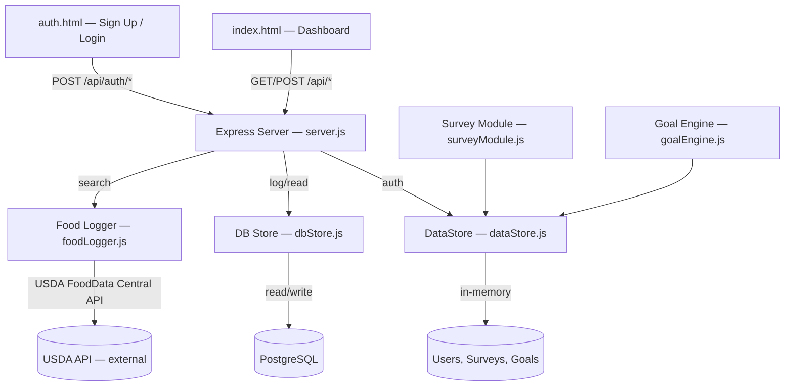

# Design & Architecture v1 — CALTRC

## Overview

CALTRC is a calorie-tracking application designed for people who want to improve their health but find traditional food logging tedious. Users complete a short health survey, receive a personalized daily calorie/macro goal, and then log food intake by scanning barcodes or entering data manually. The app automatically tallies consumption against the daily goal.

---

## Architecture Diagram



**Data flow (current runtime):**
1. The **Frontend** (`auth.html`, `index.html`) sends HTTP requests to the **Express Server**.
2. **Auth routes** validate credentials against the in-memory **DataStore**.
3. **Food search** queries the **USDA FoodData Central API** and returns parsed results.
4. **Food logging** writes entries to PostgreSQL via the **DB Store**.
5. **Survey Module** and **Goal Engine** are implemented and tested but not yet wired into the UI.

---

## Top Components / Modules

| Module | File | Responsibility | Status |
|--------|------|---------------|:---------:|
| **Express Server** | `server.js` | REST endpoints, static file serving, auth routes | ✅ Live |
| **Food Logger** | `foodLogger.js` | USDA API search, food entry creation, daily log retrieval | ✅ Live |
| **DB Store** | `dbStore.js` | Read/write food entries to PostgreSQL | ✅ Live |
| **DataStore** | `dataStore.js` | In-memory persistence for users, surveys, goals | ✅ Live (auth) |
| **Survey Module** | `surveyModule.js` | Health survey validation and storage | ✅ Tested, not in UI |
| **Goal Engine** | `goalEngine.js` | Computes daily calorie/macro targets from survey data | ✅ Tested, not in UI |
| **Frontend** | `public/` | Auth pages, dashboard, food search & log UI | ✅ Live |

---

## Key Interfaces (API Endpoints)

| Method | Endpoint | Description | M3 Status |
|--------|----------|-------------|:---------:|
| `POST` | `/api/auth/signup` | Create account (name, email, password) → token | ✅ |
| `POST` | `/api/auth/login` | Login with email/password → token | ✅ |
| `GET` | `/api/food/search?q=...` | Search USDA FoodData Central for foods | ✅ |
| `POST` | `/api/log` | Log a food entry (name, calories, protein, carbs, fat) | ✅ |
| `GET` | `/api/log?date=YYYY-MM-DD` | Get food entries and macro totals for a date | ✅ |

### Internal Function Boundaries

```
surveyModule.submitSurvey(userId, answers[], store)  → { success, data | errors }
surveyModule.getSurvey(userId, store)                → SurveyResponse | null

foodLogger.searchFood(query, fetchFn?)               → FoodResult[]
foodLogger.logFood(userId, foodData, store)           → FoodEntry
foodLogger.getTodayLog(userId, store)                 → FoodEntry[]

goalEngine.computeGoals(surveyData)                   → DailyGoal
goalEngine.getProgress(userId, store)                 → { goal, consumed }

dbStore.appendEntry(entry)                            → void
dbStore.loadEntries(date)                             → FoodEntry[]
dbStore.computeTotals(entries)                        → MacroTotals
```

---

## Data Model

### Key Entities

```
User {
  id:        string (UUID)
  name:      string
  email:     string
  createdAt: Date
}

SurveyResponse {
  userId:      string
  answers:     { questionId: string, value: string | number }[]
  completedAt: Date
}

FoodEntry {
  id:        string (UUID)
  userId:    string
  barcode:   string | null
  name:      string
  calories:  number
  protein:   number
  carbs:     number
  fat:       number
  loggedAt:  Date
}

DailyGoal {
  userId:        string
  date:          string (YYYY-MM-DD)
  calorieTarget: number
  proteinTarget: number
  carbTarget:    number
  fatTarget:     number
}
```

### Storage Strategy

| Phase | Storage | Used For | Rationale |
|-------|---------|----------|----------|
| Current | PostgreSQL (`db`, `dbStore`) | Auth, sessions, surveys, goals, food log entries | Durable persistence and query support |
| Current | In-memory (`DataStore`) | Module-local test helpers | Lightweight and isolated for unit tests |

---

## Tradeoffs & Architectural Decisions (ADRs)

### ADR-1: Database-backed Runtime Storage

- **Decision:** Use PostgreSQL-backed persistence for runtime paths.
- **Rationale:** Better security, durability, and multi-user behavior for deployed environments.
- **Trade-off:** Requires database configuration and migration maintenance.

### ADR-2: USDA FoodData Central API vs. Local Food Database

- **Decision:** Use the [USDA FoodData Central API](https://fdc.nal.usda.gov/) for food search.
- **Rationale:** Authoritative, free, comprehensive nutritional data with no API key required for basic search.
- **Trade-off:** Depends on network availability. Mitigated by supporting manual entry as a fallback.

### ADR-3: Monolith vs. Microservices

- **Decision:** Single Node.js monolith.
- **Rationale:** Team of 4, MVP scope, simple deployment. Microservices add unnecessary complexity.
- **Trade-off:** Harder to scale individual modules independently. Acceptable at this stage.

### ADR-4: Server-side Survey Logic vs. Client-side

- **Decision:** All survey validation and goal computation happens server-side.
- **Rationale:** Single source of truth, easier testing, prevents client-side tampering.
- **Trade-off:** Requires network round-trip for survey submission. Acceptable latency for this use case.

---

## Risks & Unknowns

| # | Risk | Likelihood | Impact | Mitigation |
|---|------|-----------|--------|------------|
| 1 | **Barcode API reliability / accuracy** — OpenFoodFacts may have missing or inaccurate data for some products | Medium | High | Support manual entry as fallback; validate data before storing |
| 2 | **Team availability during midterms** — reduced velocity | High | Medium | Front-load critical work; build buffer into sprint plan |
| 3 | **Schema migration drift** — table/schema changes may break runtime paths | Medium | Medium | Keep migrations versioned and validate with CI integration tests |
